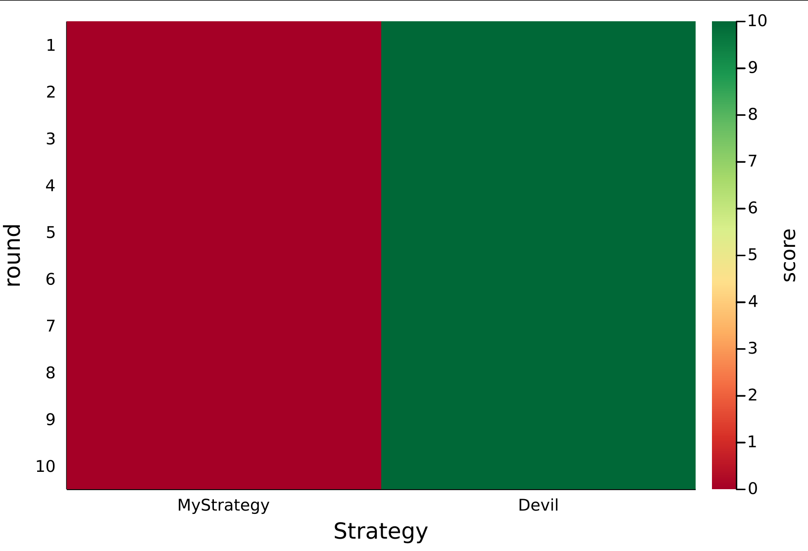

# SquidGame.jl

[](https://andrewrosemberg.github.io/SquidGame.jl/stable)
[](https://andrewrosemberg.github.io/SquidGame.jl/dev)
[](https://github.com/andrewrosemberg/SquidGame.jl/actions/workflows/JuliaNightly.yml?query=branch%3Amain)
[](https://codecov.io/gh/andrewrosemberg/SquidGame.jl)
[](https://github.com/andrewrosemberg/BlueStyle)
[](https://github.com/SciML/ColPrac)

Strategy simulation for simple games.

## Instalation

```julia
] add SquidGame
```

## Overview

Using function `play_game`, simulates a game for of `N` strategies competing against each other (where `N` is the appropriate number of players for the game).

Implementable games are "deterministic" games where each player knows the possible rewards for each round at decision time, with the only uncertainty being the action of other players.

Rewards are defined as a multi-dimensional array where entries your action is the first index and rivals are the remaining indexes. For example, a 2 player game:

|               | Rival Action 1| Rival Action 2|
| ------------- | ------------- | ------------- |
| Your Action 1 |      5.0      |      0.0      |
| Your Action 2 |      10.0     |      2.0      |

In this case:
 - If you acted with action `1` and your rival also chose action `1`, you would both earn `5` points;
 - If you acted with action `1` and your rival chose action `2`, you would earn `0` and they would earn `10`. 

## Example Prisoner Game
```julia
using SquidGame
import SquidGame._run_strategy
using Plots

number_of_rounds = 10

# Define Game
# (The infrastructure is generic enough so you can have different rewards per iteration).
prisoner_game = prisoner(number_of_rounds) # same as `Game(; rewards=(iter) -> [[5. 0]; [10 2]], number_of_rounds)`


# Define a name for your strategy
abstract type MyStrategy <: Strategy end

# Define the logic of your strategy
function SquidGame._run_strategy(::Type{MyStrategy}, reward::AbstractArray{Float64}, 
    history::Union{NamedTuple{(:my_action, :their_action, :my_reward, :their_reward), Tuple{Vector{Int64}, Matrix{Int64}, Vector{Float64}, Matrix{Float64}}}, Missing},
    rounds_left::Union{Int,  Missing}
)
    
    # your can use whatever logic you wish. This example is an angel, it will always choose the cooperative action.
    return find_cooperative_action(reward)
end

strategies = Vector{Type{<:Strategy}}()

# push it to the stage
push!(strategies, MyStrategy)

# Push your opponent 
push!(strategies, Devil)

# Simulate the game.
realized_reward_history, strategies_action_history = play_game(prisoner_game, strategies)

# Visualise the scores over all rounds 
scoreboard(realized_reward_history, strategies)
```


## Play a game with 3 players

```julia 
# add a player 
push!(strategies, RandomStrategy)

# choose the game
random_game = randgame(number_of_rounds)

realized_reward_history, strategies_action_history = play_game(random_game, strategies)
```